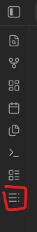
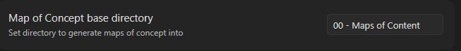
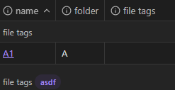
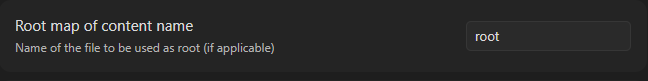

# Map of Content Generator

This is a utility that generates pre-filtered bases on a folder of your choice so that you can use them as maps of content if you use Maps of Content.
I found myself going through the same motions over and over so I made this to automate and manage that.

## Settings
### Enable ribbon button
Description: 
> Whether to display the ribbon button for manual generation  

Default value:
> On

Example:  

### Map of content directory

Description: 
> Path of the folder where your maps of content will be stored.

Default value:
> empty

Notes:
> Do not add the leading / to the path of the folder

Example:  

### Map of content template

> [!caution] 
> This is temporarily disabled as I figure out how to use the file search API
> to make it use a file instead of raw text

Description:
>  The text that will be inserted/updated into the maps of content (except root)

### Root map template

> [!caution] 
> This is temporarily disabled as I figure out how to use the file search API
> to make it use a file instead of raw text

Description:
>  The text that will be inserted/updated into the root map of content

### Exclude all bases

Description:
> Whether to show other bases in the view

Default value:
> On

Example on:  

Example off:  

### Exclude self

> [!important]
> This might be removed as it doesn't really apply  
>
> This was left undocumented intentionally

### Delete empty folders on generation

> [!caution]
> This can and will delete your map of content folder if it contains no files after the generation process.  
> Make sure you have at least one other folder before starting the generation if this is turned on.  
> This can also be avoided by having [Generate root map of content](#generate-root-map-of-content) set to on.

Description:
> Delete any empty sub-folders under the map of content folder after generation

Default value:
> On

### Generate on startup

> [!warning]
> The processing time grows the more folders and maps of content you have.  
> If Obsidian is taking a long time to start up try turning this off and running it manually every now and then.

Description:
> Whether to generate and/or update the maps of content on startup.

Default value:
> On

> [!note]
> The base results themselves are updated by Obsidian.  
> On update only the queries and views are updated.

### Update templates on generation

> [!warning]
> This is a destructive operation.  
> Once a base has been updated you'll lose any customization you might've put on top of it.

Description:
> Whether to update the bases queries regardless of when they were created

Default value:
> On

### Ignore extras during update

Description:
> Whether to update or ignore the queries for bases that do not map to any specific folder.  
> On = Extras will be ignored
> This was made with the intention to allow people to have custom bases beyond what this tool provides.  
> See also [Remove extra bases](#remove-extra-bases)

Default value:
> On

### Generate root map of content

Description:
> Whether to generate a special map of content that maps other bases in the map of content folder.  
> This is intended to be the entry point for the maps of content themselves.

Default value:
> On

### Root map of content name

Description:
> Name of the root map of content if generated.  
> This is the name of the file, not the whole path.

Default value:
> root

Example:  

### Remove extra bases

Description:
> Whether to remove bases from the map of content folder that do not map to any folder in the vault.  
> This was made with the intention to allow people to have custom bases beyond what this tool provides.  
> For obvious reasons this precedes "Ignore extras during update"  
> See also [ignore extras during update](#ignore-extras-during-update)

Default Value:
> On